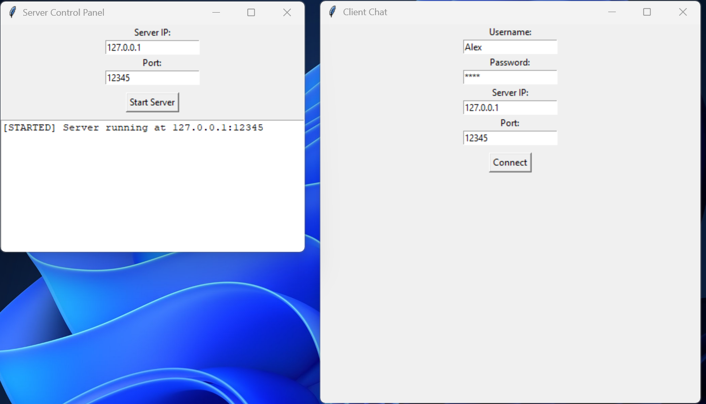
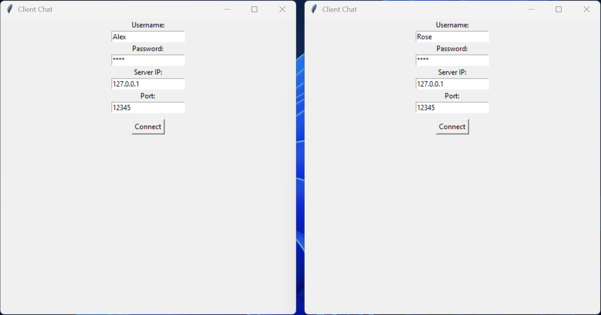
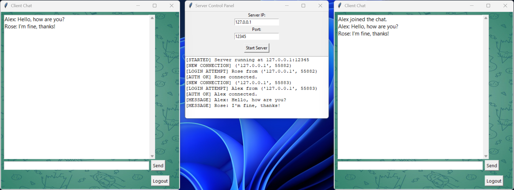

# 💬 Simple Python Messenger

Небольшой локальный мессенджер, реализующий клиент-серверное взаимодействие с графическим интерфейсом на **Tkinter**. Позволяет подключаться к серверу, авторизоваться, обмениваться сообщениями в реальном времени.

---

## 🚀 Особенности

- Клиент и сервер написаны на **Python**.
- Удобный GUI-интерфейс с использованием **Tkinter**.
- Авторизация через `users.txt`.
- Реализация чата с несколькими клиентами.
- Плавная анимация вывода сообщений (эффект печати).
- Сервер отображает подключения, сообщения и ошибки в отдельном окне.

---

## 🖥️ Интерфейс

### Клиент:
- Авторизация (логин, пароль, IP, порт).
- Общий чат с прокруткой и историей.
- Анимированный вывод сообщений.
- Возможность выхода в главное меню.

### Сервер:
- Запуск по IP и порту.
- Логирование подключений, сообщений, ошибок.
- Авторизация клиентов по базе `users.txt`.

---

## 📸 Скриншоты

### Запуск сервера и клиента


### Авторизация клиентов


### Отправка сообщения первым клиентом


### Отправка сообщения вторым клиентом


---

## 📦 Зависимости

- `tkinter` (стандартный модуль).
- `Pillow` – библиотека для работы с изображениями (используется для фона в клиенте).

Установить Pillow:
```bash
pip install pillow
```

---

## ▶️ Как запустить

1. Убедитесь, что установлен Python 3.13+.
2. Добавьте пользователей в users.txt, например:
```
alice:123
bob:qwerty
```
3. Запустите сервер:
```
python server.py
```
4. Затем запусти одного или нескольких клиентов:
```
python client.py
```
5. Введите IP (обычно 127.0.0.1), порт (например, 12345), имя и пароль – и общайтесь!

---

## 📌 Заметки

- Клиенты и сервер работают локально, по умолчанию используется 127.0.0.1:12345.
- Все данные передаются в незашифрованном виде.
- Подходит для обучения работы с сокетами и потоками в Python.

---

## 📄 Лицензия

Проект распространяется под лицензией [MIT](LICENSE).